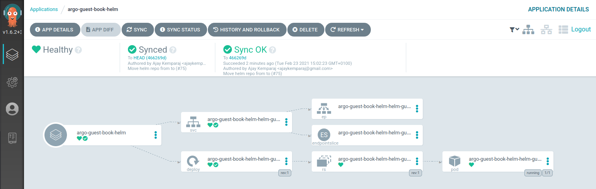

# Argo CD

https://argoproj.github.io/argo-cd

---

## Installation

### CLI installation

```bash
curl -sLO https://github.com/argoproj/argo-cd/releases/download/v1.6.2/argocd-linux-amd64
chmod +x argocd-linux-amd64
mv ./argocd-linux-amd64 /usr/local/bin/argocd
argocd version
```

### Kind cluster

```bash
kind create cluster --name argocd --config kind/config.yaml
```

### Argo Workflows

```bash
kustomize build ./argocd/base  | kubectl apply -f -
```

## ArgoCD UI

```bash
firefox -new-tab 172.18.255.240
kubectl port-forward svc/argocd-server -n argocd 8080:443
ARGOCD_LOGIN = "admin"
ARGOCD_PASSWORD = $(kubectl get pods -n argocd | grep -m1 argocd-server | awk  '{print $1}')
```



## Create deployment cluster and add context to argocd

```bash
kind create cluster --name argocd-integration --config kind/argo-integration.yaml
argocd cluster add kind-argocd-integration
```

## Add Applications to be synced

```bash
# Using kubectx to switch kubernetes context
# Switching back to argocd cluster
kubectx kind-argocd
kubectl apply -f app/example-app.yaml
kubectl apply -f app/example-app-helm.yaml
```

## CLI

```bash
# Login
argocd login <argo server IP>
# example: argocd login 172.18.255.240

# Update password
argocd update password

# List clusters
argocd cluster list*

# List apps
argocd app list
```

## Specific cluster addtion

```bash
CLUSTER_NAME="kind-argocd-integration"

# Point to the API server referring the cluster name
APISERVER=$(kubectl config view -o jsonpath="{.clusters[?(@.name==\"$CLUSTER_NAME\")].cluster.server}")

# Gets the token value
TOKEN=$(kubectl get secrets -o jsonpath="{.items[?(@.metadata.annotations['kubernetes\.io/service-account\.name']=='default')].data.token}" |base64 --decode)

cat <<EOF  > argo-integration-cluster-secret.yaml
apiVersion: v1
kind: Secret
metadata:
  name: argo-integration-cluster-secret
  labels:
    argocd.argoproj.io/secret-type: cluster
type: Opaque
stringData:
  name: $CLUSTER_NAME
  server: $APISERVER
  namespaces: default
  config: |
    {
     "bearerToken": "$TOKEN",
      "tlsClientConfig": {
        "insecure": false,
        "caData": "LS0tLS1CRUdJTiBDRVJUSUZJQ0FURS0tLS0tCk1JSUM1ekNDQWMrZ0F3SUJBZ0lCQURBTkJna3Foa2lHOXcwQkFRc0ZBREFWTVJNd0VRWURWUVFERXdwcmRXSmwKY201bGRHVnpNQjRYRFRJeE1ESXlNekV4TURNME9Wb1hEVE14TURJeU1URXhNRE0wT1Zvd0ZURVRNQkVHQTFVRQpBeE1LYTNWaVpYSnVaWFJsY3pDQ0FTSXdEUVlKS29aSWh2Y05BUUVCQlFBRGdnRVBBRENDQVFvQ2dnRUJBS0xRCkdUL2lzNzVjL0diQkdxR3F3blZKRjQvVERxUS96bW1CdnM2VkdkVzU2eHgxcVR6c1dyRmpzOVozOEVHRG8zckQKQ0NSZkdiZzBMbEpYTnBNcFk1TlI4MUM0MjdKRklETC9vbm82NkRFTWlNbGQrVkl2MmtCZ0UyQnlrVkpwWUJ4agpPcEJER3hvZFNOT3ZMWkxQRU8wZVNOeHFxSldmWjZMZjVOdmV0TFlsc2wrbElzelFxVWpMQTRwbnJxT1NIbnRzCjRDT1laa1hoYmU2Q2VXbGRSRitaUndOdFdLeUhLbndPNy95czBlTHRCTlNtTi9DdTVGQ2R6dXNmSEtvSFREZ0UKUEhUTnNQWXM3aUxSa0JLSWQwWUZ2SW5aSkVLMVpwZVdTNm9mbjhOb1h4VzBvbWRBbVhaN3R1bkdSU2R5KzJxNQovUHpNL1FMRWdMTStoeEpJTEhFQ0F3RUFBYU5DTUVBd0RnWURWUjBQQVFIL0JBUURBZ0trTUE4R0ExVWRFd0VCCi93UUZNQU1CQWY4d0hRWURWUjBPQkJZRUZHTUhCMEdWSXRiZEt1WTU1N3VJS0czd2ZkaFNNQTBHQ1NxR1NJYjMKRFFFQkN3VUFBNElCQVFCdmd2NlpMWTZQeE9RMkRLeVdOOTNRcXJzTjIyVVZNakMwdVZtT2V0SS93aWhRMzBwRApmLy9OM29EWWlHQ0Y4TmhxR013elJvODVGZ21Yd2JFWHEzbEVIVnNjRGpZRnhGTDhiWVhPZ0d6a01lWUlLZzlwCkJEb0pyNWNSTjF6c1BsbklRQ0k1ZVZFNVI5WTBsbWhZR3MveUx0cjFLblFnVUVsT25zc0ZWR0czRlJpM0VQYXMKYWx2U0YybWFSb2d6aU81YVZJVC9PNUpBOTJVUVBERTlxVzlvOEE1QlpQVm5mOGFSNFExenNyTEdJWXFsblErdgpFcWVPclAyTU9JQStOTUhpb01TNnVnSmNZV2NqbGdZM3I5M2FSczlNcDNWVGxFVklkR1gwc3RXQnRLcDNUWk1iCnVUSXRhUnYyZUIwOUdFdFJ0cXBIUEtVUmJZZUFUR0FKOGF3dAotLS0tLUVORCBDRVJUSUZJQ0FURS0tLS0tCg=="
      }
    }
EOF
```

## Additional links:

https://itnext.io/argocd-setup-external-clusters-by-name-d3d58a53acb0
https://gist.github.com/janeczku/b16154194f7f03f772645303af8e9f80
